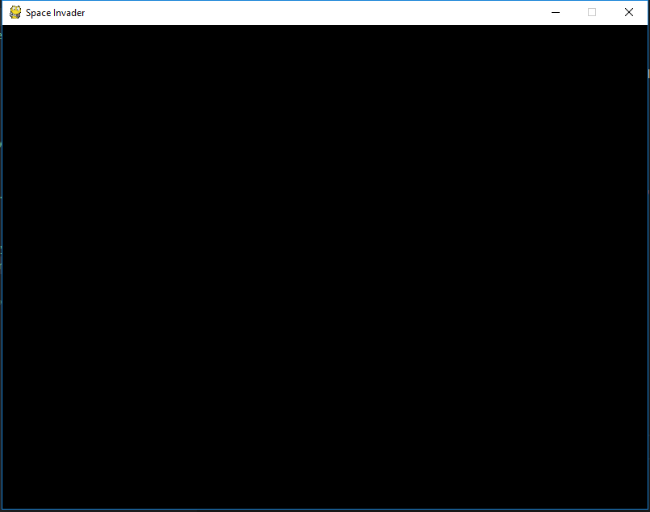

# Space Invaders

[](https://www.python.org)
[](http://www.pygame.org/news.html)
[](https://kennethphang.asia/space-invaders.html)

## Pre-requisite

* Visual Studio Code/ Atom
* Python 3

## Install Pygame Game Engine

```bash
pip install pygame
```

## Download the artifacts from Google Drive 

1. Download all the assets files from the following link. (https://bit.ly/2paxaQG)
2. Unzip all the folders from the zip file into the game project directory.

## Development logbook - Round 1 (Preparation)

1. Create a Game Project directory as spaceinvader
2. Create the following files in the game directory
    * blocker.py
    * bullet.py
    * enemy.py
    * explosion.py
    * bullet.py
    * enemy.py
    * life.py
    * main.py
    * mystery.py
    * ship.py
    * spaceinvader.py
    * text.py

 3. Under the <b>spaceinvader.py</b> python source code create a class, along with the initialization function as shown below. The best way to set custom mixer playback values is to call pygame.mixer.pre_init() before calling the top level pygame.init(). For backward compatibility argument values of zero is replaced with the startup defaults. e.g. frequency=22050, size=-16, channels=2, buffersize=4096

    * Initalize the game engine
    * Set the screen resolution to 800 x 600
    * Load the background image to the screen game object 

 ```python
import platform
platform.architecture()
from pygame import *
import sys

SCREEN 	= display.set_mode((800,600))

class SpaceInvaders(object):
    def __init__(self):
        print("init ...")
        mixer.pre_init(44100, -16, 1,512)
        init()
        self.caption = display.set_caption("Space Invader")
        self.background = image.load('images/background.jpg').convert()
        self.screen = SCREEN
        self.mainScreen = True
        self.startGame = False
        self.gameOver = False

    ## check for keyboard input 
    def check_input(self):
        self.keys = key.get_pressed()
        for e in event.get():
            if e.type == QUIT:
                sys.exit()

    ## create game menu
    def create_main_menu(self):
        for e in event.get():
            if e.type == QUIT:
                sys.exit()
            if e.type == KEYUP:
                print("key up")
                self.startGame = True
                self.mainScreen = False
    def reset(self, score, lines, newGame=False)

    def main(self):
        print("init ...")
        while True:
            if self.mainScreen:
                print("main screen...")
                self.reset(0, 3, True) # custom reset function
                self.create_main_menu()
            elif self.startGame:
                print("start game ...")
                sys.exit()
            elif self.gameOver :
                print("game over ...")
        
 ```

4. Run the space invader game under the editor terminal. Resultant launching the game window shown as below:-

```bash
python main.py
```



5. Under the spaceinvader.py source code load all the images into a list in python and also initailize the font used in the game. All th values in the IMG_NAMES must match the image files under the images sub-directory 

```python
FONT = "fonts/space_invaders.ttf"
IMG_NAMES = ["ship", "mystery", "enemy1_1","enemy1_2", "enemy2_1", "enemy2_2", 
            "enemy3_1", "enemy3_2", "explosionblue", "explosiongreen", "explosionpurple", "laser", "enemylaser"]

IMAGES  = {name: image.load("images/{}.png".format(name)).convert_alpha() for name in IMG_NAMES}
```

5. Edit the create_main_menu function to incorporate splash screen. Append the following codes.

```python
def create_main_menu(self):
    self.enemy1 = IMAGES["enemy3_1"]
    self.enemy1 = transform.scale(self.enemy1, (40, 40))
    self.screen.blit(self.enemy1, (318, 270))
```
6. Let's continue editing the spaceinvader.py source file. Under if block of the main screen lets implement all the reset function to initialize all the object and values to the original state.

```python
def reset(self, score, lives, newGame=False):
        self.clock = time.Clock()
```

7. On the main screen's under the if block let's make sure we call all the above functions. Also display the background of the game.

```python
self.reset(0,3,True)
self.screen.blit(self.background, (0,0))
self.create_main_menu()
```

8. We constantly need to update the game engine with the changes. Right after the if block under the while loop we append update display function and tick the frame rate per second to refresh the screen. 

```python
display.update()
self.clock.tick(60)
```


9. Amend the text.py source file with below codes. This is create an object to render text in pygame game engine.

```python
from pygame import *

class Text(object):
    def __init__(self, textFont, size, message, color, xpos, ypos):
        self.font = font.Font(textFont, size)
        self.surface = self.font.render(message, True, color)
        self.rect = self.surface.get_rect(topleft=(xpos, ypos))
    
    def draw(self, surface):
        surface.blit(self.surface, self.rect)
```

10. Under the reset function add a create_text function call 

```python
def reset(self, score, lives, newGame=False):
        self.clock = time.Clock()
        self.create_text()
```

11. Import the text object into the spaceinvader.py source file

```python
from text import Text
```

12. Create a new function name it as create_text() invoke text object create a title on the screen

```python
def create_text(self):
        # font , scale , value, colour , x , y
        print("create text")
        self.titleText = Text(FONT, 50, "Space Invaders", WHITE, 164, 155)
```

13. Remaining of the codes for part 1 :-

```python
import platform
platform.architecture()
from pygame import *
import sys
from random import shuffle, randrange, choice
from text import Text

#        R     G    B
WHITE = (255, 255, 255)
GREEN = (78, 255, 87)
YELLOW = (241, 255, 0)
BLUE = (80, 255, 239)
PURPLE = (203, 0, 255)
RED = (237, 28, 36)


SCREEN 	= display.set_mode((800,600))
FONT = "fonts/space_invaders.ttf"
IMG_NAMES = ["ship", "mystery", "enemy1_1","enemy1_2", "enemy2_1", "enemy2_2", 
   "enemy3_1", "enemy3_2", "explosionblue", "explosiongreen", "explosionpurple", "laser", "enemylaser"]

IMAGES  = {name: image.load("images/{}.png".format(name)).convert_alpha() for name in IMG_NAMES}


class SpaceInvaders(object):
    def __init__(self):
        mixer.pre_init(44100, -16, 1,512)
        init()
        self.caption = display.set_caption("Space Invader")
        self.background = image.load('images/background.jpg').convert()
        print(self.background)
        self.screen = SCREEN
        self.mainScreen = True
        self.startGame = False
        self.gameOver = False

    ## check for keyboard input 
    def check_input(self):
        self.keys = key.get_pressed()
        for e in event.get():
          if e.type == QUIT:
            sys.exit()

    ## create game menu
    def create_main_menu(self):
        # TODO create a custom splash screen
        self.enemy1 = IMAGES["enemy3_1"]
        self.enemy1 = transform.scale(self.enemy1, (40, 40))
        self.enemy2 = IMAGES["enemy2_2"]
        self.enemy2 = transform.scale(self.enemy2 , (40, 40))
        self.enemy3 = IMAGES["enemy1_2"]
        self.enemy3 = transform.scale(self.enemy3 , (40, 40))
        self.enemy4 = IMAGES["mystery"]
        self.enemy4 = transform.scale(self.enemy4 , (80, 40))
        
        self.screen.blit(self.enemy1, (318, 270))
        self.screen.blit(self.enemy2, (318, 320))
        self.screen.blit(self.enemy3, (318, 370))
        self.screen.blit(self.enemy4, (299, 420))
        
        for e in event.get():
          if e.type == QUIT:
                sys.exit()
          if e.type == KEYUP:
                print("key up")
                self.startGame = True
                self.mainScreen = False

    def create_text(self):
        # font , scale , value, colour , x , y
        print("create text")
        self.titleText = Text(FONT, 50, "Space Invaders", WHITE, 164, 155)
        self.titleText2 = Text(FONT, 25, "Press any key to continue", WHITE, 201, 225)
        self.gameOver = Text(FONT, 50, "Game Over", WHITE, 250, 270)
        self.nextRoundText = Text(FONT, 50, "Next Round", WHITE, 240, 270)
        self.enemy1Text = Text(FONT, 25, "   =   5 pts", GREEN, 368, 270)
        self.enemy2Text = Text(FONT, 25, "   =  10 pts", BLUE, 368, 320)
        self.enemy3Text = Text(FONT, 25, "   =  15 pts", PURPLE, 368, 370)
        self.enemy4Text = Text(FONT, 25, "   =  ?????", RED, 368, 420)
        self.scoreText = Text(FONT, 20, "Score", WHITE, 5, 5)
        self.livesText = Text(FONT, 20, "Lives ", WHITE, 640, 5)
        

    def reset(self, score, lives, newGame=False):
        self.clock = time.Clock()
        self.create_text()

    def main(self):
        while True:
            if self.mainScreen:
                self.reset(0,3,True)
                self.screen.blit(self.background, (0,0))
                self.titleText.draw(self.screen)
                self.titleText2.draw(self.screen)
                self.enemy1Text.draw(self.screen)
                self.enemy2Text.draw(self.screen)
                self.enemy3Text.draw(self.screen)
                self.enemy4Text.draw(self.screen)
                self.create_main_menu()
            elif self.startGame:
                print("start game ...")
                sys.exit()
            elif self.gameOver :
                print("game over ...")

            display.update()
            self.clock.tick(60)
```

## Development logbook - Round 2 (Create a player Ship)

1. Create a ship class

```python
class Ship(sprite.Sprite):
    def __init__(self, shipImage):
        sprite.Sprite.__init__(self)

    def update(self, keys, game, *args):
        print("ship update")
```
2. Implement the initialize and update function. The update function must take in keyboard events from the game window

```python
class Ship(sprite.Sprite):
    def __init__(self, shipImage):
        sprite.Sprite.__init__(self)
        self.image = shipImage
        self.rect = self.image.get_rect(topleft=(375, 540))
        self.speed = 5

    def update(self, keys, game, *args):
        print("ship update")
        if keys[K_LEFT] and self.rect.x > 10:
            self.rect.x -= self.speed
        if keys[K_RIGHT] and self.rect.x < 740:
            self.rect.x += self.speed
        game.blit(self.image, self.rect)
```

3. Under the main game file spaceinvader.py add an instantiation functionality on the reset function to spawn a new ship object.

```python
def reset(self, score, lives, newGame=False):
        self.player = Ship(IMAGES["ship"]) # this line
        self.clock = time.Clock()
        self.shipTimer = time.get_ticks()
        self.create_text()
```

4. Back to the main game loop, constantly update the ship sprite.
```python
self.player.update(self.keys, self.screen)
```

5. Lastly add in the logic how the ship suppose to animate when a left and right keyboard is pressed

```python
from pygame import *

class Ship(sprite.Sprite):
    def __init__(self, shipImage):
        sprite.Sprite.__init__(self)
        self.image = shipImage
        self.rect = self.image.get_rect(topleft=(375, 540))
        self.speed = 5

    def update(self, keys, game, *args):
        if keys[K_LEFT] and self.rect.x > 10:
            self.rect.x -= self.speed
        if keys[K_RIGHT] and self.rect.x < 740:
            self.rect.x += self.speed
        game.blit(self.image, self.rect)
```


## Frequency Ask Questions

1. What is self in Python
<br>
The reason you need to use self. Is because Python does not use the @ syntax to refer to instance attributes. Python decided to do methods in a way that makes the instance to which the method belongs be passed automatically, but not received automatically: the first parameter of methods is the instance the method is called on. That makes methods entirely the same as functions, and leaves the actual name to use up to you (although self is the convention, and people will generally frown at you when you use something else.) self is not special to the code, it's just another object. 
(https://pythontips.com/2013/08/07/the-self-variable-in-python-explained/)

2. What is a class in Python ? <br>
Python is an object oriented programming language. Almost everything in Python is an object, with its properties and methods. A Class is like an object constructor, or a "blueprint" for creating objects.

3. What Is Blitting? <br>
First, you need to realize what blitting is doing. Your screen is just a collection of pixels, and blitting is doing a complete copy of one set of pixels onto another. For example, you can have a surface with an image that you loaded from the hard drive, and can display it multiple times on the screen in different positions by blitting that surface on top of the screen surface multiple times.

4. What does clock.tick does? <br>
FPS, Frames Per Second, is the number of frames shown per unit of time.
1 / FPS is the amount of time should pass between each frame. Tick is just a measure of time in PyGame. clock.tick(60) means that for every second at most 60 frames should pass.


5. What is a python tuple ? <br>
A tuple is a collection which is ordered and unchangeable. In Python tuples are written with round brackets. Please look at the colour declaration example WHITE = (255, 255, 255)

6. What is a screen clock in pygame? <br>
This is an object to help you to keep track of time in pygame
